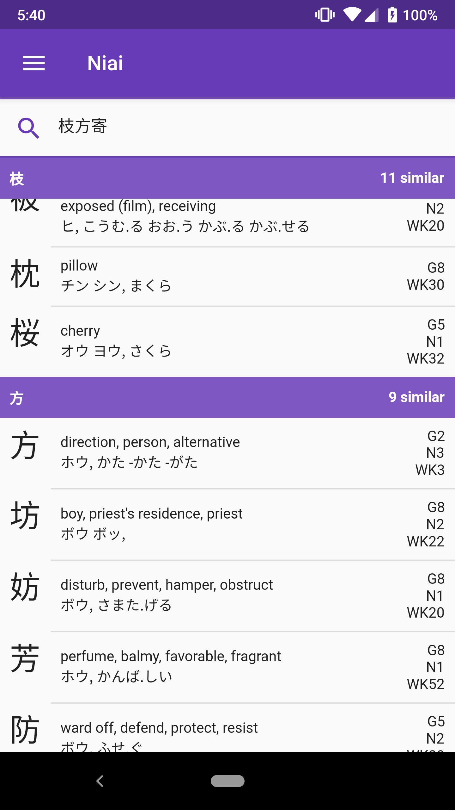

# niai

Lookup similar Kanjis, Homonyms, Synonyms!

This solution consists of several modules listed below.

## Modules

### Aggregator

This is a console application that incorporates several dictionaries, as well as data from [WaniKani](https://www.wanikani.com), and produces various aggregated data readily available for usage in the backend.

This is basically run only once to produce the json files. You can execute `./produce.ps1` to produce the files.

Technology stack: .Net Core

### Niai

This is the web api that powers everything. A swagger document is also published at "/swagger".

Technology stack: Asp.Net Core

### Web

This is the website.

Technology stack: vue.js, TypeScript, scss

### Mobile

ios version coming soon.

Technology stack: flutter

## Usage

If you're trying to run the aggregator app, you should add your WK api key to an environment variable:

- `WK_INFO_API_KEY`: Your WK api key. Make sure to set this to your own api key, you can find it at https://www.wanikani.com/settings/account.

## News

- We were featured in a Tofugu article! https://www.tofugu.com/japanese/japanese-learning-resources-march-2019/

## Credit

- JMdict: http://www.edrdg.org/enamdict/enamdict_doc.html
- KANJIDIC: http://nihongo.monash.edu/kanjidic2/index.html
- Innocent Corpus: https://forum.koohii.com/post-168613.html#pid168613
- @mwil's WK scripts: https://github.com/mwil/wanikani-userscripts
- Logo by [@Tobaloidee](https://github.com/Tobaloidee)
